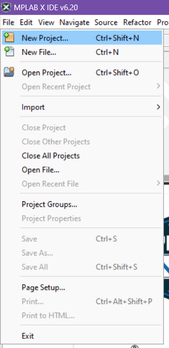
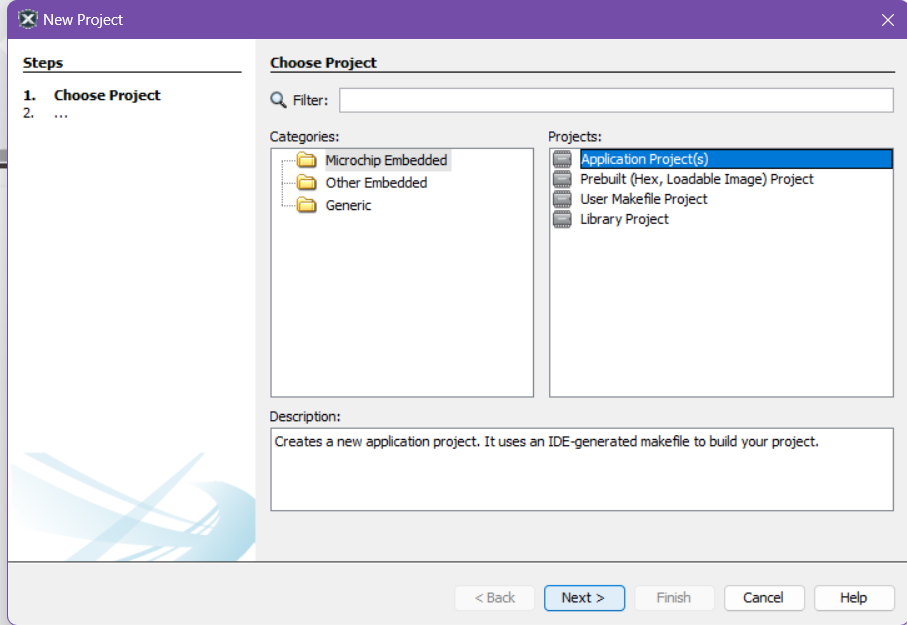
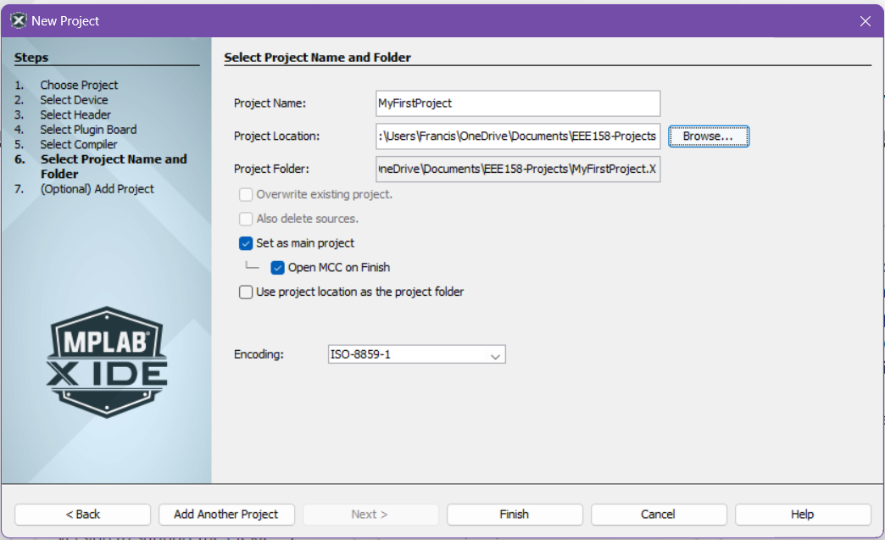

# MPLAB First Steps

## Installation

### Install MPLAB X IDE

Install MPLAB X IDE through the official Microchip site: [MPLAB X IDE](https://www.microchip.com/en-us/tools-resources/develop/mplab-x-ide)

### Install XC32 Compiler

Install the XC32 COmpilers from Microchip: [MPLAB xC32 Compilers](https://www.microchip.com/en-us/tools-resources/develop/mplab-xc-compilers/xc32#downloads)

### Your First Bare-Metal Project

- Create a New Project



- Choose `Application Project(s)` then click `Next >`



- Choose the following for `2. Select Device`
  - `Device`: `PIC32CM5164LS00048`
  - `Tool`: `Simulator`

  *note: you can always change the tool later, will be useful once we move from using the simulator to actual hardware*


- Choose a installed XC32 Compiler
  - *note: if you do not see options for compilers, make you have properly installed the XC32 Compilers from the `Install XC32 Compilers` Step*


- Select where to save your Project on your local machine then click `Finish`

*note: We suggest creating a new folder within another folder when you create a project as another folder will be generated in the same directory as the path you choose here (i.e. if you plan on storing all your Projects in a folder called `MyProjects`, create a folder `MyProjects/MyFirstProject` and choose `MyFirstProject` as the place to save)*


*note: Unlick the `Open MCC on Finish option as we won't be using that for now*

- Your First Project should now initialize


Let's now proceed to creating a `main.c` file so we can start coding our application.

## Guided Exercise: "Blinky!"

### Blinky!

Create a `main.c` file. Right click on the `Source Files` of the Project Tab then click `New` and `C Main File`


Proceed to input the following code into `main.c`

```c
#include <stdio.h>
#include <stdlib.h>
#include <xc.h>
/*
 * 
 */

int crude_ms_delay(int ms){
    int count = 0;
    unsigned int delay_count = ms * 240;
    
    while(count < delay_count){
        asm("nop");
        count = count + 1;
    }
    return 0;
}

int main() {
     //Set the Data Direction for PA15 as Output
    PORT_SEC_REGS->GROUP[0].PORT_DIRSET = (1 << 15);
    
    //Set the Initial Output Value for PA15 as HIGH
    PORT_SEC_REGS->GROUP[0].PORT_OUTSET = (1 << 15);
    
    
    while(1){
        //Toggle the Output of PA15
        PORT_SEC_REGS->GROUP[0].PORT_OUTTGL = (1 << 15);
        crude_ms_delay(1000);
    }
    return (EXIT_SUCCESS);
}
```

Let us first try Building our Application. Press the `Build` Icon to compile your project. It's the one that looks like a hammer


If it builds, we are now ready to try and debug your application.

#### Simulator Debugging

*note: the simulator has limited functionality in simulating the PORT peripheral*


Include a breakpoint in your program by clicking on the line number on the left side of the code editor


Click on the `Debug Main Project` button on the ribbon to begin Simulator Debugging.

##### Application Execution Control

These buttons on the ribbon will allow you to control the debugging of your application.


- `Finish Debugger Session` - End Debugging
- `Pause` - Pause Application Execution
- `Reset` - Reset Application Execution
- `Continue` - Resume Application Execution
- `Step Over` - Step over a line of your Application
- `Step Into` - Step into a a method in your Application
- `Step Out` - Step out of a method in your application
- `Run to Cursor`
- `Set PC at Cursor`
- `Focus Cursor at PC`

Your debugger should stop at the break point we set earlier


Press the `Step Over` Button and you should go into the next line of the Application code


Now press the `Step Into` Button and you should go into the `crude_ms_delay` method


Press the `Continue` button and after a while, you should hit the breakpoint again


#### Target Memory Views

Target memory views allows us to look at the contents of the memory of our device under test (DUT). You can open this by navigating in the ribbon. `Window` -> `Target Memory Views`


Let's try and open up the `Peripherals` Memory View.


This allows us to directly check the contents of the registers and is useful for debugging.

#### Hardware Debugging

Hardware debugging is similar to Simulator debugging and you can perform any of the Application Execution Controls and Memory View functionality. 

To change the `Tool` from Simulator to you on-board debugger

- Plug in your Curiosity Nano board to your machine
- Click on `Project Properties` 


- Change the `Connected Hardware Tool` to you on-board debugger


- When you perform debugging now, the program will first upload to your microcontroller and you can proceed with debugging.

## Your First MCC Project

MPLAB Code Configurator (MCC) is a tool from Microchip which allows us to easily configure our Microcontroller by automatically creating macros we can use for our code. Let's try and use it.

- Create a New Project


- Choose `Application Project(s)` then click `Next >`


- Choose the following for `2. Select Device`
  - `Device`: `PIC32CM5164LS00048`
  - `Tool`: `Simulator`

  *note: you can always change the tool later, will be useful once we move from using the simulator to actual hardware*


- Choose a installed XC32 Compiler
  - *note: if you do not see options for compilers, make you have properly installed the XC32 Compilers from the `Install XC32 Compilers` Step*


- Select where to save your Project on your local machine then click `Finish`

*note: We suggest creating a new folder within another folder when you create a project as another folder will be generated in the same directory as the path you choose here (i.e. if you plan on storing all your Projects in a folder called `MyProjects`, create a folder `MyProjects/MyFirstProject` and choose `MyFirstProject` as the place to save)*



- Your First Project should now initialize


- We now proceed to setting up the MPLAB Code Configurator, It will either open up automatically or you can open it by clicking on the `MCC` icon on the top ribbon


### MPLAB Code Configurator

- Download content for MPLAB Code Configurator (MCC)


- On your first time opening, MCC will automatically ask you to download some files.

#### Board Packages

- Chip Support Package: proceed to also include `csp_apps_pic32cm_le_ls` from under `Harmony 3 - Chip Support Packages`


- Core Apps Package: proceed to also include `core_apps_pic32cm_le_ls` from under `Harmony 3 - Core`


*note: you can also add these packages later by opening up the `Content Manager` (CM button beside MCC) if you don't install them now*

#### MCC Harmony Windows

We now proceed with using MCC to easily create some configurations for our Microcontroller

Open up `MCC` and navigate to `Pin Configuration` either through the ribbon or through the Project Graph


We can use a GUI to set up the pins of our Microcontroller. Proceed to set up PA15 as Output Pin as shown. Take note of the `Security Mode` being set as `NON-SECURE` as well.


- Click on Generate to generate your configuration code


You should now see in your Project folder more files, these were auto generated by MCC. The interesting one here is the header file `plib_port.h`


You can use these newly declared definition in you code to control the Pin.

- Go to `main.c` under `Source Files`


Here is where you can start creating your application. Let's blink try and blink an LED by switching a pin between HIGH and LOW.

## Guided Exercise: "MCC-Blinky!"

### Blinky!

- in `main.c` add the function call `LED_PIN_Toggle();` and also this `crude_delay_ms()` function before `main()`

```C
int crude_ms_delay(int ms){
    int count = 0;
    unsigned int delay_count = ms * 12000;
    
    while(count < delay_count){
        asm("nop");
        count = count + 1;
    }
    return 0;
}


int main ( void )
{
    /* Initialize all modules */
    SYS_Initialize ( NULL );

    while ( true )
    {
        LED_PIN_Toggle();
        crude_ms_delay(1000);
        /* Maintain state machines of all polled MPLAB Harmony modules. */
        SYS_Tasks ( );
    }

    /* Execution should not come here during normal operation */

    return ( EXIT_FAILURE );
}
```

Let us first try Building our Application. Press the `Build` Icon to compile your project. It's the one that looks like a hammer


If it builds, we are now ready to try and debug your application.
