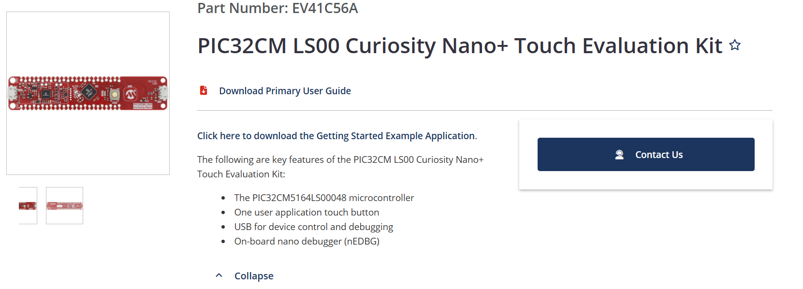

# Documentation for the PIC32CM LS00 Curiosity Nano Evaluation Kit

## Official Page from Microchip

You can obtain the PIC32CM LS00 Curiosity Nano+ Touch Evaluation Kit `Primary User Guide` on the Official Microchip Web Page. 

[PIC32CM LS00 Curiosity Nano + Touch Evaluation Kit | Microchip technology](https://www.microchip.com/en-us/development-tool/EV41C56A)

Please download a copy of the `Primary User Guide` and use it as reference.

## Notes on Hardware

- You will need a USB-A to USB-Micro data cable to connect your board to a PC

- You will need to solder male pin headers to the Curiosity Nano for it to sit on the Curiosity Nano Evaluation Board

- Plugging the board to your PC will have it show up as a Drive named `CURIOSITY`
